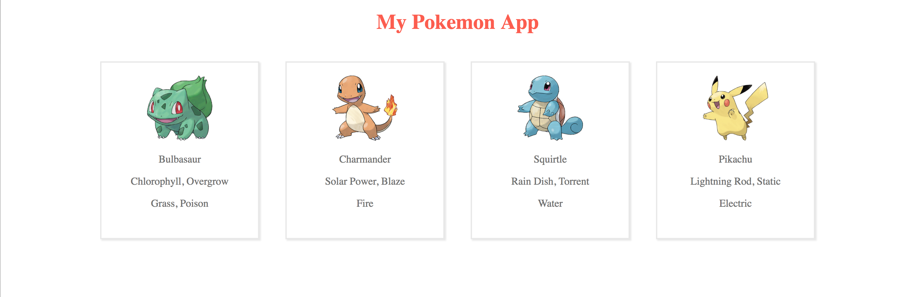

# Chapter 2: Build Pokemon card view 

Our goal for this section is to create a container and component to build a list of Pokemon with mock data. You will learn how to create a container and component, and pass props from parent to child. 

## Instructions

We are going to be building a list of Pokemon displayed in cards from a mock data set. 

## Build the Pokemon container

To ensure clean code and easier readability, we are going to separate our components into containers and presentational components.

> A container is React component that does data fetching, handles state, and renders sub components. It handles all the logic and data manipulation then passes the data down to its presentational components as props. In future chapters, the container will handle all of the Redux state management as well.

> A presentational component is a "dumb" component that only receives data from its parent and should never change the data itself. They are be reusable and should only render the views. 

Create a `src/container` folder. Create a `src/containers/Pokemon.js` file. 

Import the following dependencies and create the Pokemon class that extends Component. 

```
import React, { Component } from 'react';
class Pokemon extends Component {
  render() {
    return (
      <div>
      </div>
    );
  }
}

export default Pokemon;
```

Import the Pokemon container into `src/App.js` file below the other imports 

```
import Pokemon from './containers/Pokemon';
````

Create a Pokemon tag after the h1 tag.

```
<Pokemon />
```

In the Pokemon container `src/containers/Pokemon.js`, insert the styles we will use to display a list of Pokemon in between the imports and class and apply to the div tag. 

```
const styles = {
  list: {
    display: "flex",
    flexWrap: "wrap",
    justifyContent: "center"
  },
  card: {
    color: "#707070",
    padding: "20px 20px 0 20px",
    width: "200px",
    height: "250px",
    border: "2px solid #E8E8E8",
    margin: "20px",
    boxShadow: "2px 2px 2px #E8E8E8"
  },
  image: {
    width: "100px",
    height: "100px"
  }
};
```

```
<div style={styles.list}>
```

Let's create some Pokemon mock data for our container to display. 

Insert the `mockData` variable under the `styles` variable. 

```
const mockData = [{
  name: 'Bulbasaur',
  image: 'https://img.pokemondb.net/artwork/bulbasaur.jpg',
  abilities: 'Chlorophyll, Overgrow',
  type: 'Grass, Poison'
},
{
  name: 'Charmander',
  image: 'https://img.pokemondb.net/artwork/charmander.jpg',
  abilities: 'Solar Power, Blaze',
  type: 'Fire'
},
{
  name: 'Squirtle',
  image: 'https://img.pokemondb.net/artwork/squirtle.jpg',
  abilities: 'Rain Dish, Torrent',
  type: 'Water'
},
{
  name: 'Pikachu',
  image: 'https://img.pokemondb.net/artwork/pikachu.jpg',
  abilities: 'Lightning Rod, Static',
  type: 'Electric'
}]
```

We need to create a card for each element in the array to display to the user. Let's use the `map()` method to create a new array returning a card for each Pokemon.

Insert the `map()` function between the div tags. 

```
  {mockData.map(pokemon => {
    return <div key={pokemon.name} style={styles.card}>
        
        <p>{pokemon.name}</p>
        <p>{pokemon.abilities}</p>
        <p>{pokemon.type}</p>
      </div>
  })}
```

At this point, you should be able to see Pokemon information but there is no layout or styling. Let's pull out the card element into its own presentational component. 

## Create the Card presentational component

Create a `src/components` folder. Create a `src/components/Card.js` file. 

Import dependencies and  create the Card class to extend Component. 

```
import React, { Component } from 'react';
class Card extends Component {
  render() {
    return (
      <div>
      </div>
    );
  }
}

export default Card;
```

Import the Card component into the Pokemon container `src/containers/Pokemon.js` file below the other imports 

```
import Card from '../components/Card';
```

Replace the `return` code in the `map()` function with

```
return <Card key={pokemon.name} pokemon={pokemon} styles={styles} />
```


The above code is passing the Pokemon object and card styles as props to the Card component. This will allow us to use these variables in our Card component. 

> Props aka properties are parameters of a component. Props are how components talk to each other and how parent containers or components can pass down data to child components. 

We need to add the prop-types npm dependency to be able to use props in the component. If you're using CodeSanbox, click 'Add Dependency' under the Dependencies dropdown and enter `prop-types`. If you're doing this locally, do an `npm install prop-types --save`. 

Insert the prop-types import in the Card component `src/components/Card.js` below the other imports.
```
import PropTypes from 'prop-types';
```

React has built-in typechecking on props for a component. Let's add that to our Card component. In between the Card class and export line insert the propTypes:

```
Card.propTypes = {
  styles: PropTypes.object.isRequired,
  pokemon: PropTypes.object.isRequired,
}
```

We need to use these props in our component. Insert 

```
const { styles, pokemon } = this.props;
```
in between the `render()` function and `return`. 

Now let's show our prop values to the user. Replace the div tags with the following: 

```
<div key={pokemon.name} style={styles.card}>
  
  <p>{pokemon.name}</p>
  <p>{pokemon.abilities}</p>
  <p>{pokemon.type}</p>
</div>
```

You can see how we're passing down the data from the parent container to the child component and displaying the it to the user.

## Final Result

You should now have a working application showing a list of Pokemons in a card view! In the next chapter, we will pull in real Pokemon data using the Pokemon API with GraphQL. 


